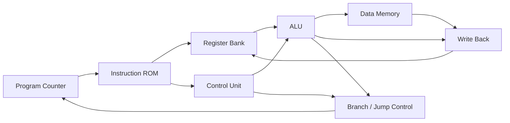
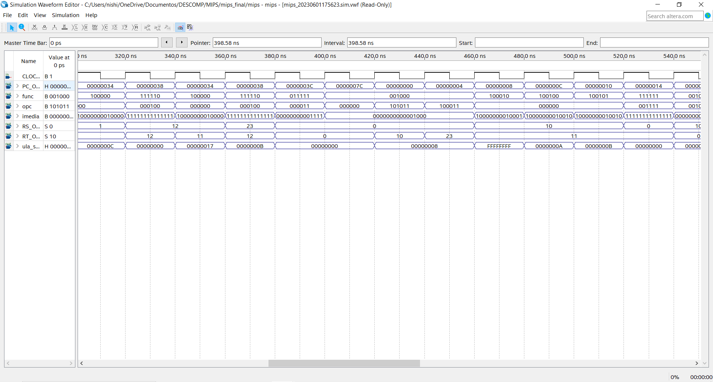

# MIPS Processor in VHDL

Academic computer architecture project developed in **2023** during my Computer Engineering studies at **Insper**.

The project implements a **32-bit MIPS-style processor in VHDL** and targets an **Intel Cyclone V FPGA (DE0-CV board)** using Intel Quartus Prime.

The final implementation integrates the processor datapath, control logic, register bank, ALU, instruction and data memories, branch/jump handling and FPGA output visualization.

## Architecture

A simplified high-level view of the non-pipelined processor datapath is shown below:



The top-level module also implements branch and jump selection, immediate extension, memory access and write-back multiplexing.

## Supported Instructions

The control logic and test program in `ROMcontent.mif` include support for:

### R-Type

- `add`
- `sub`
- `and`
- `or`
- `slt`
- `jr`

### I-Type

- `addi`
- `andi`
- `ori`
- `slti`
- `lw`
- `sw`
- `beq`
- `bne`
- `lui`

### J-Type

- `j`
- `jal`

## Main Components

The final implementation is located in `mips_final/`.

| Component | Description |
| --- | --- |
| `MIPS.vhd` | Top-level processor datapath and component integration |
| `unidadeControle.vhd` | Main instruction control logic |
| `unidadeControleULA.vhd` | ALU control selection |
| `decoderOPCODE.vhd` | Opcode decoding for I-type operations |
| `decoderFUNCT.vhd` | Function decoding for R-type operations |
| `ula_aula16.vhd` | 32-bit ALU |
| `bancoReg.vhd` | 32-register bank with two read ports and one write port |
| `ROMMIPS.vhd` | Instruction memory |
| `RAMMIPS.vhd` | Data memory |
| `SinalGenerico.vhd` | Sign / zero extension for immediate values |
| `LUI.vhd` | Immediate upper-half loading |
| `display.vhd` | FPGA seven-segment display integration |

## FPGA Integration

The Quartus project targets:

- **Board:** DE0-CV
- **FPGA family:** Intel Cyclone V
- **Device:** 5CEBA4F23C7
- **Quartus Prime:** 20.1 Lite Edition
- **HDL:** VHDL-2008

The design maps processor values to the board's six seven-segment displays and LEDs. A switch selects which internal value is visualized, and the push-button input is used in the clock/step logic.

## Test Program

`mips_final/ROMcontent.mif` contains a small instruction sequence used to exercise the processor implementation. It covers memory access, arithmetic, logical operations, branches and jumps.

Examples from the ROM include:

```asm
sw   $t1, 8($zero)
lw   $t0, 8($zero)
sub  $t0, $t1, $t2
and  $t0, $t1, $t2
or   $t0, $t1, $t2
lui  $t0, 0xFFFF
addi $t0, $t1, 0x000A
bne  $t0, $t5, -2
beq  $t0, $t3, -2
jal  0x00001F
jr   $ra
```

## Simulation

The repository includes waveform and simulation artifacts from the original project.



## Project Evolution

The repository preserves the development stages of the original academic project:

- `aula15/` — early processor implementation
- `aula16/` — expanded datapath and ALU work
- `mips_intermediaria_sem_fpga/` — intermediate processor version before FPGA integration
- `mips_fpga/` — FPGA-oriented version
- `mips_final/` — final implementation

Keeping these stages makes it possible to follow the progression from individual processor components to the final integrated design.

## Technologies

**VHDL · MIPS Architecture · Digital Logic · FPGA · Intel Quartus Prime · Cyclone V**

## Historical Context

This repository preserves the original 2023 implementation. The VHDL code has not been rewritten as a modernized version; the portfolio refresh focuses on documentation and repository organization while keeping the original academic work intact.
